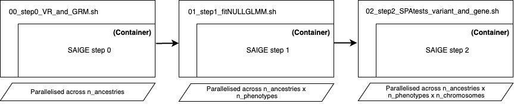

<h1 align="center">
  Universal-SAIGE
</h1>

> [!IMPORTANT]
> If you are a BRaVa analyst looking to run these steps in your biobank/cohort, check out these helpful templates:
> - [step 0](https://github.com/BRaVa-genetics/universal-saige/blob/main/templates/step_0_template.sh)
> - [step 1](https://github.com/BRaVa-genetics/universal-saige/blob/main/templates/step_1_template.sh)
> - [step 2](https://github.com/BRaVa-genetics/universal-saige/blob/main/templates/step_2_template.sh)
>   
> You'll need to replace filepaths, column names etc in the commands with the corresponding column names in your data. Free text portions of the commands to be changed are placed in square brackets `[like this]`, portions of the commands where you'll need to make a choice between a collection of options are placed in braces `{like this}`.

<p align="center">
  
</p>

> [!TIP]
> Here's a [walkthrough](https://github.com/BRaVa-genetics/universal-saige/tree/main/walkthrough) 
 of a single trait and chromosome 11 for all three steps

### Contents
* [Overview](#overview)
* [System Requirements](#system-requirements)
* [Input data (required)](#input-data-required)
* [Input data (optional)](#input-data-optional)
* [Usage](#usage)
  * [Step 0 (once per cohort/biobank)](#step-0-once-per-cohortbiobank)
  * [Step 1 (once per phenotype)](#step-1-once-per-phenotype)
  * [Step 2 (once per chromosome per phenotype)](#step-2-once-per-chromosome-per-phenotype)

## Overview

_Run SAIGE preprocessing and steps 1 and 2 without any hassle._

- Containerised SAIGE (Docker / Singularity): the slim build `astheeggeggs/saige-slim`, pulled from Docker Hub ✅
- PLINK 2 (`.pgen/.pvar/.psam`, **recommended**) and PLINK 1 (`.bed/.bim/.fam`) exome data ✅
- SAIGE-GENE+ group tests and **FlexRV** (Schwartzentruber et al. 2025), with an AlphaMissense weight builder ✅
- Parallelised across ancestry, phenotypes and chromosomes ✅
- Sanity checks, and the image's own fit gates ✅

> [!IMPORTANT]
> **Use PLINK 2 format.** Convert your exome data once with `plink2 --vcf exome.chr20.vcf.gz --make-pgen --out exome.chr20`
> (`download_resources.sh --plink2` fetches plink2). The SAIGE image reads PLINK 2 and PLINK 1 genotypes and **nothing else**:
> there is no VCF reader, and step 2 refuses a VCF rather than convert it on every chromosome of every phenotype.

> [!NOTE]
> The image's **fit gates are on**. A binary trait fitted on fewer than 100 cases, a categorical covariate level with fewer than
> 10 cases or controls, a separated covariate model, or a fit that did not converge is refused, in step 1 and again when
> step 2 loads the model, with the gate named in the log. That refusal is the right answer for such a trait (the tail of the
> tests is not calibrated there). `SAIGE_FIT_GATES=0` in your environment turns the refusals into warnings; not recommended.

The choices baked into the drivers (Firth off, fastTest off, `--tol 0.02` for both trait types, `--minMAC 4` for
single-variant tests, the build's missingness defaults) are the ones the All of Us production runs used; the record is
`docs/state/aou-saige-parameters.md` in the `saige-slim` repository.

## System Requirements
- Internet connection (only needed once for download_resources.sh)
- Docker OR Singularity
- Linux OR Mac
### Getting started
```
bash download_resources.sh --saige-image --plink2           # Docker: the SAIGE image and plink2
bash download_resources.sh --saige-image --plink2 --singularity
bash download_resources.sh --plink                          # plink 1.9, used by step 0 only
bash download_resources.sh --alphamissense                  # the AlphaMissense release, for FlexRV weights (~600 MB)
```
`SAIGE_IMAGE` and `SAIGE_VERSION` in `download_resources.sh` pin the image; record the tag with your results.

## Input data (required)
- WES data in PLINK 2 (`.pgen/.pvar/.psam`, recommended) or PLINK 1 (`.bim/.bed/.fam`) format, one file set per chromosome
- Sample IDs, (ancestry specific)
- SAIGE annotation file ([details found here](https://docs.google.com/document/d/11Nnb_nUjHnqKCkIB3SQAbR6fl66ICdeA-x_HyGWsBXM/edit#heading=h.649be2dis6c1))
- BRaVa phenotype file (tsv) with 'IID' (sample ID) column and covariates

## Input data (optional)
- Genotyping array data for every sample included in the WES data above. Recommended.
- For FlexRV: the AlphaMissense release (`download_resources.sh --alphamissense`), or another per-variant score in [0, 1]

## Usage
### Step 0 (once per cohort/biobank)
Take genotyping array data, or `{WES, WGS}` data, in PLINK 1 (`.bed/.bim/.fam`) or PLINK 2 (`.pgen/.pvar/.psam`) format, and generate variance ratios and a sparse GRM.

```
usage: 00_step0_VR_and_GRM.sh
```
required:
- `--geneticDataDirectory`: directory containing the genetic data (genotyping array data, or `{WES, WGS}` files).
- `--geneticDataFormat`: format of the genetic data `{plink, pgen}`: PLINK 1 or PLINK 2. A VCF is refused; convert it once with `plink2 --vcf FILE.vcf.gz --make-pgen --out PREFIX`.
- `--geneticDataType`: type of the genetic data `{WES, WGS, genotype}`.
- `-o`,`--outputPrefix`: output prefix from this program (SAIGE step 0) to be used as SAIGE step 1 input.

optional:
- `-s`,`--isSingularity` (default: `false`): is singularity available? If not, it is assumed that docker is available.
- `--generate_GRM` (default: false): generate GRM for the genetic data.
- `--generate_plink_for_vr` (default: false): generate plink file for vr.
- `--sampleIDs`: single column of sample IDs (matched on IID) to define the GRM and the variance-ratio markers' samples; all samples when omitted. **Note, if this is not _all_ of the samples in the `{WES, WGS}` dataset, the `{WES, WGS}` data must be filtered to these samples before running step 1**

> [!IMPORTANT]
> All files contained within `--geneticDataDirectory` of the type flagged by `--geneticDataFormat` will be globbed, so please ensure that this contains all of the autosomes for _just one biobank/cohort_ and not multiple!

### Step 1 (once per phenotype)

```
usage: 01_step1_fitNULLGLMM.sh
```
required:
- `-t`,`--traitType`: type of the trait `{quantitative, binary}`.
- `--genotypePlink`: variance ratio plink filename prefix of `.bim/.bed/.fam` files. This must relative to the current working directory. Note that samples will be restricted to samples present within the plink `.fam` file.
- `--sparseGRM`: filename of the sparseGRM `.mtx` file (output from step 0). This must be relative to the current working directory.
- `--sparseGRMID`: filename of the sparseGRM ID file (output from step 0). This must be relative to the current working directory.
- `--phenoFile`: filename of the phenotype file. This must be relative to the working directory.
- `--phenoCol`: the column names of the phenotype to be analysed in the file specified in `--phenoFile`.

optional:
- `-o`,`--outputPrefix`:  output prefix from this program (SAIGE step 1) to be used as SAIGE step 2 input.
- `-s`,`--isSingularity`: (default: false): is singularity available? If not, it is assumed that docker is available.
- `-c`,`--covarColList`: comma separated column names (e.g. `age,pc1,pc2`) of continuous covariates to include as fixed effects in the file specified in `--phenoFile`. Recall, proposed pilot fixed effect covariates are `age,age2,sex,age*sex,age2*sex,PCs`.
- `--categCovarColList`: comma separated column names of categorical variables to include as fixed effects in the file specified in --phenoFile.
- `--sampleIDCol` (default: IID): column containing the sample IDs in the phenotype file, which must match the sample IDs in the plink files.

### Step 2 (once per chromosome per phenotype)

```
usage: 02_step2_SPAtests_variant_and_gene.sh
```
required:
- `--chr`: chromosome to test, spelled as in the `.pvar`/`.bim` (`chr20` or `20`).
- `--testType`: type of test `{variant,group}` (implied by `--flexRVscore`).
- `--pgen`: PLINK 2 filename prefix of `.pgen/.pvar/.psam` for WES (or WGS restricted to exons), **recommended**; or `-p`,`--plink`: the PLINK 1 prefix. Relative to the current working directory. A `--vcf` is refused: convert once with plink2.
- `--modelFile`, `--varianceRatio`: the step-1 outputs. Relative to the current working directory.
- `--sparseGRM`, `--sparseGRMID`: the step-0 GRM and its sample IDs. Relative to the current working directory.

optional:
- `-o`,`--outputPrefix`: output prefix (step 2). Group tests also write `<prefix>.txt.singleAssoc.txt`, `.markerList.txt`, `.skatoMethod.txt` (which p-value method each SKAT-O cell used) and, when there is something to report, the sidecars `.pooledTests.txt`, `.skatFailures.txt`, `.spaFallbacks.txt`.
- `-s`,`--isSingularity` (default: false).
- `-g`,`--groupFile`: required for a group test. The annotation file.
- `--annotations`: required for a group test. `':'` joins labels into one mask, `','` separates masks. For SAIGE-GENE+ use `pLoF,damaging_missense_or_protein_altering,other_missense_or_protein_altering,synonymous,pLoF:damaging_missense_or_protein_altering,pLoF:damaging_missense_or_protein_altering:other_missense_or_protein_altering:synonymous`.
- `--relatednessCutoff` (default 0.05): must equal the cutoff step 1 fitted under; nothing in SAIGE checks it.
- `--condition`, `--subSampleFile`, `--dryRun` (prints the SAIGE command).

FlexRV (one run per weight set):
- `--flexRVscore NAME`: run FlexRV on the group file's `score:NAME` line (built by step 4 below). One annotation mask (default `pLoF:damaging_missense_or_protein_altering:other_missense_or_protein_altering`), one max MAF (`--flexRVmaxMAF`, default 0.001), burden statistic. The results file carries one row per transform set and the pooled `p_FlexRV` row (`Group == Cauchy`).
- `--flexRVlofAnno` (default `pLoF`): the label(s) the `lof` transform keys on, the same labels the score line was built with.

### Step 4: FlexRV weights (once per chromosome per weight set)

```
usage: 04_flexrv_groupfile.sh --group <BRaVa group file> --chr <c> --name AM --out <group file>.flexrv_AM.txt
```
adds a `score:AM` line to every gene of the BRaVa group file from the AlphaMissense release (LoF variants 1.0 by
annotation, missense variants their AlphaMissense pathogenicity, a missense variant with no score its gene's mean).
A second weight set goes through the same door: `--annoTable <BRaVa long-form table> --scoreColumn <column> --name <NAME>`
for a score carried as a column of the annotation table, or `--am <table>` for a score in AlphaMissense's per-variant
layout. One score line per file, so one file and one step-2 run per weight set. The tool behind it is
`flexrv_score_from_alphamissense.py` (`--help`, and `--selftest` for its controls).

### Step 3

```
usage: 03_estimate_nGlmm.sh
```
required:
- `--binaryPhenos`: space separated list of binary phenotypes.
- `--contPhenos`: space separated list of continuous phenotypes.
- `--phenoFile`: filename of the phenotype file.
- `--sparseGRM`: filename of the sparseGRM .mtx file.
- `--sparseGRMID`: filename of the sparseGRM ID file.

Each is relative to the current working directory, or an absolute path under it, under `/mnt/project` (the UKB RAP
project mount, bound read-only whenever it exists), or under a directory listed, colon-separated, in the
`SAIGE_EXTRA_MOUNTS` environment variable. On the RAP, `--phenoFile /mnt/project/...` works as it is.

optional:
- `--covarList`: comma separated covariate column names in `--phenoFile`.
- `-o`,`--outputFile` (default `neff.csv`): one `pheno,nglmm` row per phenotype; each phenotype's log is `<outputFile without .csv>.<pheno>.log`.
- `-s`,`--isSingularity` (default: false), `--dryRun`.

Nglmm is `1' K^-1 1` on the sparse GRM `K` over the phenotype's analysed samples (times `4 Pn (1 - Pn)` for a binary
trait, `Pn` the case fraction): a function of the relatedness and the case fraction, not of the phenotype's heritability.
A phenotype whose fit fails gets no row, and the script exits non-zero.
