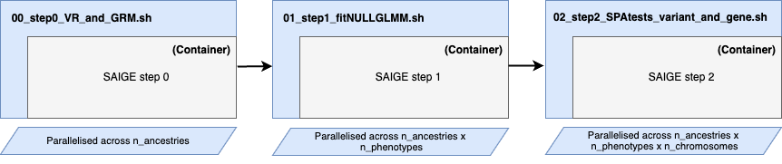

<h1 align="center">
  Universal-SAIGE
</h1>

<p align="center">
  
</p>

> **Important**
> If you are a BRaVa analyst looking to run these steps in your biobank/cohort, check out these helpful templates:
> - placeholder for step 0
> - placeholder for step 1
> - placeholder for step 2
>   
> You'll need to replace filepaths, column names etc in the commands with the corresponding column names in your data. Portions of the commands to be changed are placed in square brackets [like this].

> **Note**
> Here's a [walkthrough](https://github.com/BRaVa-genetics/universal-saige/tree/main/walkthrough) 
 of a single trait and chromosome 11 for all three steps

### Contents
* [Overview](#overview)
* [System Requirements](#system-requirements)
* [Input data (required)](#input-data-required)
* [Input data (optional)](#input-data-optional)
* [Usage](#usage)
  * [Step 0 (once per cohort/biobank)](#step-0-once-per-cohortbiobank)
  * [Step 1 (once per phenotype)](#step-1-once-per-phenotype)
  * [Step 2 (once per chromosome per phenotype)](#step-2-once-per-chromosome-per-phenotype)

## Overview

_Run SAIGE preprocessing and steps 1 and 2 without any hassle._

- Containerised SAIGE (Docker / Singularity) ✅
- Supporting VCF and PLINK exome data formats ✅
- Parallelised across ancestry, phenotypes and chromosomes ✅
- Sanity checks ✅

## System Requirements
- Internet connection (only needed once for download_resources.sh)
- Docker OR Singularity
- Linux OR Mac

## Input data (required)
- WES data in PLINK (`.bim/.bed/.fam`) or VCF format
- Sample IDs, (ancestry specific)
- SAIGE annotation file ([details found here](https://docs.google.com/document/d/1emWqbX8ohi-9rYIW_pKSAFiMHZZUV6zyXwg7qWJNdlc/edit#heading=h.puz6ua3vxnca](https://docs.google.com/document/d/11Nnb_nUjHnqKCkIB3SQAbR6fl66ICdeA-x_HyGWsBXM/edit#heading=h.649be2dis6c1)))
- BRaVa phenotype file (tsv) with 'IID' (sample ID) column and covariates

## Input data (optional)
- Genotyping array data for every sample included in the WES data above. Recommended.

## Usage
### Step 0 (once per cohort/biobank)
Take genotyping array data in `plink` format, or `{WES, WGS}` files in `{vcf, plink}` format, and generate variance ratios and a sparse GRM.

```
usage: 00_step0_VR_and_GRM.sh
```
required:
- `--geneticDataDirectory`: directory containing the genetic data (genotyping array data in `plink` format, or `{WES, WGS}` files in `{vcf, plink}` format)
- `--geneticDataFormat`: format of the genetic data `{vcf, plink}`.
- `--sampleIDs`: `.fam` file of the sample IDs that are present in the `{WES, WGS}` data. Note, if this is not _all_ of the samples in the `{WES, WGS}` dataset, the `{WES, WGS}` data must be filtered to these samples before running step 1.

optional:
- `-o`,`--outputPrefix`: output prefix from this program (SAIGE step 0) to be used as SAIGE step 1 input.
- `-s`,`--isSingularity` (default: `false`): is singularity available? If not, it is assumed that docker is available.
- `--generate_GRM` (default: false): generate GRM for the genetic data.
- `--generate_plink_for_vr` (default: false): generate plink file for vr.

> **Important**
> All files contained within `--geneticDataDirectory` of the type flagged by `--geneticDataFormat` will be globbed! So please ensure that this contains all of the autosomes for _just one biobank/cohort_ and not multiple!

### Step 1 (once per phenotype)

```
usage: 01_step1_fitNULLGLMM.sh
```
required:
- `-t`,`--traitType`: type of the trait `{quantitative, binary}`.
- `--genotypePlink`: variance ratio plink filename prefix of `.bim/.bed/.fam` files. This must relative to the current working directory. Note that samples will be restricted to samples present within the plink `.fam` file.
- `--sparseGRM`: filename of the sparseGRM `.mtx` file (output from step 0). This must be relative to the current working directory.
- `--sparseGRMID`: filename of the sparseGRM ID file (output from step 0). This must be relative to the current working directory.
- `--phenoFile`: filename of the phenotype file. This must be relative to the working directory.
- `--phenoCol`: the column names of the phenotype to be analysed in the file specified in `--phenoFile`.

optional:
- `-o`,`--outputPrefix`:  output prefix from this program (SAIGE step 1) to be used as SAIGE step 2 input.
- `-s`,`--isSingularity`: (default: false): is singularity available? If not, it is assumed that docker is available.
- `-c`,`--covarColList`: comma separated column names (e.g. `age,pc1,pc2`) of continuous covariates to include as fixed effects in the file specified in `--phenoFile`. Recall, proposed pilot fixed effect covariates are `age,age2,sex,age*sex,age2*sex,PCs`.
- `--categCovarColList`: comma separated column names of categorical variables to include as fixed effects in the file specified in --phenoFile.
- `--sampleIDCol` (default: IID): column containing the sample IDs in the phenotype file, which must match the sample IDs in the plink files.

### Step 2 (once per chromosome per phenotype)

```
usage: 02_step2_SPAtests_variant_and_gene.sh
```
required:
- `--testType`: type of test `{variant,group}`.
- `-p`,`--plink`: plink filename prefix of `.bim/.bed/.fam` for WES (or WGS restricted to exons). These must be relative to the current working directory.
- `--vcf` vcf exome file. If a set of plink files for the WES (or WGS restricted to exons) is not available then this vcf file will be used. This must be present in the current working directory.
- `--modelFile`: filename of the model file output from SAIGE step 1. This must be relative to the current working directory.
- `--varianceRatio`: filename of the varianceRatio file output from SAIGE step 1. This must be relative to the current working directory.
- `--sparseGRM`: filename of the sparseGRM `.mtx` file output from SAIGE step 0. This must be relative to the current working directory.
- `--sparseGRMID`: filename of the sparseGRM ID file output from SAIGE step 0. This must be relative to the current working directory.
- `--chr`: chromosome to test.

optional:
- `-o`,`--outputPrefix`: output prefix from this program (SAIGE step 2).
- `-s`,`--isSingularity` (default: false): is singularity available? If not, it is assumed that docker is available.
- `-g`,`--groupFile`: required if group test is selected. Filename of the annotation file used for group tests. This must be in relation to the working directory.
